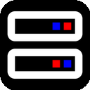
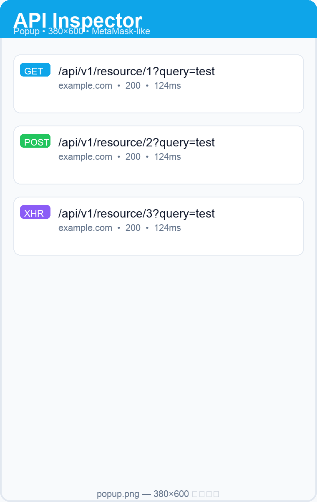
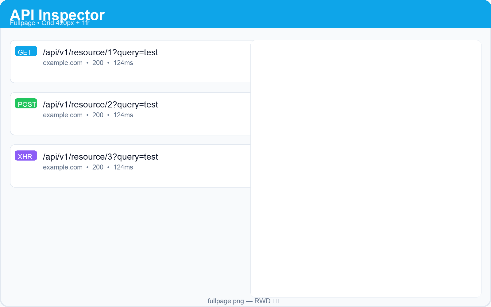
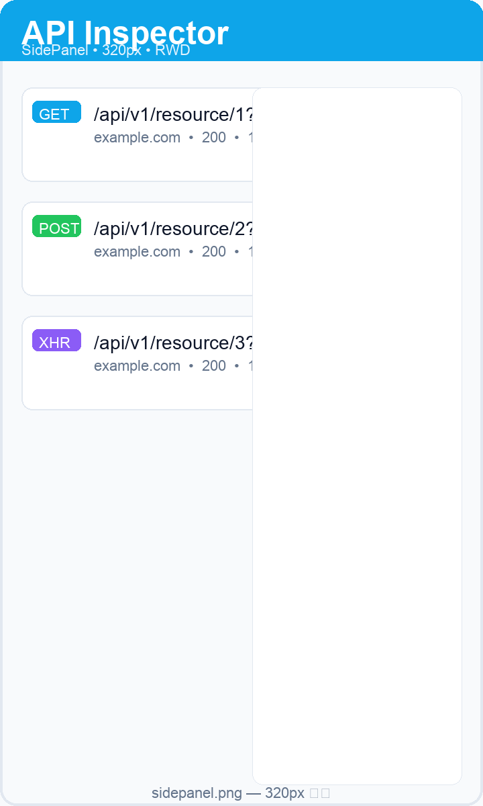
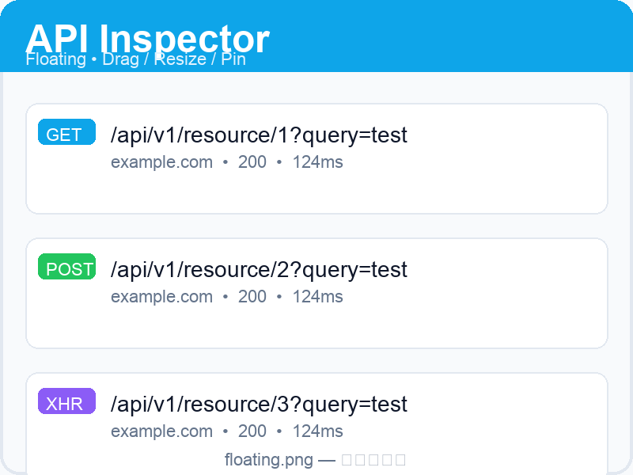

# Apii — Brave / Chrome 請求監控擴充功能

<p align="center">
  
</p>

<p align="center">
  <a href="https://github.com/anomalyco/opencode"></a>
  <a href="LICENSE"></a>
  <a href="https://developer.chrome.com/docs/extensions/mv3/"></a>
  <a href=".github/workflows/ci.yml"></a>
  
  
</p>

<p align="center">
  <b>自動擷取網頁中所有 <code>fetch</code> / <code>XHR</code> 的請求參數與後端回應</b><br>
  浮動面板（類 MetaMask）· 獨立分頁 · 側邊欄 · 懸浮可拖曳縮放 · RWD
</p>

<p align="center">
  <a href="#-功能特色">功能</a> •
  <a href="#-安裝">安裝</a> •
  <a href="#-使用方式">使用</a> •
  <a href="docs/ARCHITECTURE.md">架構</a> •
  <a href="docs/DEVELOPMENT.md">開發</a> •
  <a href="#-english">English</a>
</p>

---

## ✨ 功能特色

| 分類 | 說明 |
|------|------|
| **自動攔截** | 注入 `MAIN world` 覆寫 `window.fetch` 與 `XMLHttpRequest`，完整取得 `method/url/queryParams/requestHeaders/requestBody/responseHeaders/responseBody/status/duration/type`，支援 `JSON/FormData/URLSearchParams/Blob/ArrayBuffer`，`>50KB` 自動截斷 |
| **四種呈現** | `popup` 380×600 浮動面板（類 MetaMask）· `fullpage` RWD 雙欄分頁 · `sidepanel` `chrome.sidePanel` 窄版 · `floating-panel` 頁面內懸浮（可拖曳、右下/右/下縮放、📌 置頂、最小化） |
| **即時同步** | `background` Service Worker 寫 `chrome.storage.local`（最多 1000 筆）並 `broadcast`，所有視圖 `runtime.onMessage` + `storage.onChanged` 即時更新，徽章顯示數量 |
| **篩選搜尋** | All / Fetch / XHR / Error / Success，網域與 Method 下拉，關鍵字涵蓋 `URL/Body/Headers` |
| **詳情** | Query Params / Request Headers / Request Body / Response Headers / Response Body（JSON 深色 `pre`、自動換行），一鍵複製、複製 cURL，單欄位 `>0.5vh` 預設收合，僅收內容不遮標題 |
| **RWD** | `>1024px: 420px+1fr` · `≤768px: 單欄+Drawer` · `≤420px/側欄: 320px 單欄`，`flex-shrink:0 + overflow-wrap:anywhere` 確保不壓縮不溢出 |
| **工具** | 匯出 JSON、清空、啟用開關、徽章 `999+` |

## 📸 截圖

> 建議存放於 `assets/screenshots/`，PR 時請附 GIF

| Popup 浮動面板 | Fullpage 雙欄 | 側邊欄 320px | 懸浮可拖曳 |
|---|---|---|---|
|  |  |  |  |

*若無圖，`test.html` 可快速產生大量日誌驗證。*

## 📦 安裝

### 方式一：開發者載入（推薦）

```bash
git clone https://github.com/gjellerup1857/Apii.git
cd Apii
```

1. 開啟 `brave://extensions`（或 `chrome://extensions`）→ 右上開啟「開發者模式」
2. 點「載入未封裝項目」→ 選擇 `Apii` 資料夾
3. 重新整理任意網頁 → 點工具列 **Apii** 圖示

### 方式二：Release Zip

1. 下載 GitHub Releases 的 `Apii-v*.zip`
2. 解壓後同上「載入未封裝項目」

## 🚀 使用方式

1. 確認面板上方「監控」開關為綠色（啟用）
2. 重新整理目標頁並操作（登入、搜尋、送單）觸發 API
3. 回到面板：列表即時出現卡片（Method 彩色、Domain、Status 膠囊、耗時 `ms`）
4. 點擊卡片：
   - 桌機：右側詳情雙欄
   - 手機/側欄/懸浮窄版：全螢幕 Drawer
5. 詳情可展開/收合、複製單段、複製 cURL
6. 工具列：
   - `📌` 轉懸浮（頁面內可拖曳縮放，`📌` 置頂）
   - `⇥` 側邊欄（`chrome.sidePanel.open`）
   - `↗` 展開為新分頁（`chrome.tabs.create(fullpage.html)`，可加入 Brave 側欄書籤）
   - 側欄內 `懸浮` / `✕ 關閉` 可回到懸浮

## 🧱 專案結構

```
Apii/
├─ manifest.json              # MV3, permissions: storage/tabs/sidePanel/activeTab/scripting
├─ background.js              # Service Worker：儲存、徽章、訊息路由
├─ content.js                 # ISOLATED：注入 injected.js，橋接 postMessage
├─ injected.js                # MAIN：patch fetch/XHR
├─ floating-panel.js/.css     # 懸浮 drag/resize/pin/minimize（content_scripts idle）
├─ popup.html/.css/.js        # 380×600 浮動面板
├─ fullpage.html/.css/.js     # 完整頁 RWD
├─ sidepanel.html             # 側邊欄（複用 fullpage）
├─ icons/                     # 16/48/128
├─ test.html                  # 測試頁（fetch/XHR/FormData/大量）
├─ docs/ARCHITECTURE.md       # 架構
├─ docs/DEVELOPMENT.md        # 開發
└─ .github/workflows/         # CI / Release
```

詳見 [`docs/ARCHITECTURE.md`](docs/ARCHITECTURE.md)。

## 🛠️ 開發

```bash
python3 -m http.server 8000
# http://localhost:8000/test.html

node --check background.js && node --check content.js && node --check injected.js && node --check popup.js && node --check fullpage.js && node --check floating-panel.js
python3 -m json.tool manifest.json > /dev/null && echo "manifest ok"

# 打包
zip -r dist/Apii.zip . -x "*.git*" "*.DS_Store" "dist/*" "*.zip"
```

更多請見 [`docs/DEVELOPMENT.md`](docs/DEVELOPMENT.md) 與 [`CONTRIBUTING.md`](CONTRIBUTING.md)。

## 🔒 隱私

- 僅寫 `chrome.storage.local`，不外傳
- 忽略 `chrome-extension://`、`data:` 等內部請求
- 可隨時清空或關閉監控

## 🗺️ Roadmap

- [ ] HAR / cURL 批次匯出
- [ ] 規則過濾（忽略靜態資源、按網域黑白名單）
- [ ] WebSocket 監控
- [ ] Chrome Web Store 上架

## 🤝 貢獻

歡迎 PR / Issue！請先閱讀 `CONTRIBUTING.md`、`CODE_OF_CONDUCT.md`，並遵循 Conventional Commits。

## 📄 授權

[MIT](LICENSE) © 2026 API Inspector Contributors

---

## 🌐 English

**Apii** — Capture every `fetch`/`XHR` request params and response in Brave/Chrome, with MetaMask-like popup, standalone tab, sidePanel and draggable floating overlay (pin, resize, minimize), fully RWD.

- **Intercept**: `MAIN world` monkey-patch, `clone().text()` + `JSON.parse`, 50KB truncate
- **Views**: popup 380×600 · fullpage grid · sidePanel · floating (iframe→popup, drag/resize/pin)
- **Sync**: `background` storage + broadcast, badge `999+`
- **Install**: `brave://extensions` → Developer → Load unpacked
- **Stack**: Vanilla JS, MV3, no deps

See English docs in `docs/` and `README` above. PRs welcome!
